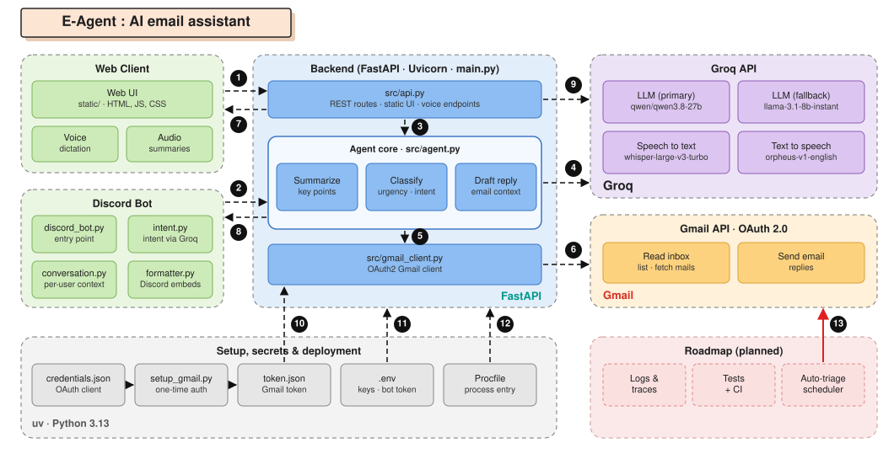

# E-Agent : Assistant Email IA

E-Agent est un agent IA connecté à votre boîte Gmail. Il utilise **Groq** pour résumer, classifier et rédiger des réponses à vos emails accessible via une **interface web** ou directement depuis **Discord**.

## Syteme design


## Fonctionnalités

- **Lecture & tri intelligent** Récupération de la boîte Gmail via l'API officielle.
- **Résumés IA**  Analyse automatique avec `Qwen 3.8 27B` pour aller à l'essentiel.
- **Classification automatique** Détection de l'urgence et de l'intention (Urgent, Important, Newsletter, etc.).
- **Génération de réponses** Brouillons rédigés automatiquement selon le contexte de l'email.
- **Bot Discord conversationnel** Contrôlez l'agent en langage naturel directement depuis Discord.
- **Dictée vocale** Dictez vos réponses grâce à **Groq Whisper** (`whisper-large-v3-turbo`).
- **Lecture audio** Écoutez les résumés via **Groq Orpheus** (`canopylabs/orpheus-v1-english`).
- **Interface web** Frontend moderne accessible sur `localhost:8000`.

## Stack Technique

| Couche | Technologies |
|---|---|
| **Backend** | Python 3.13, FastAPI, Uvicorn |
| **Bot Discord** | discord.py 2.x |
| **IA** | Groq API (`qwen/qwen3.8-27b`, `llama-3.1-8b-instant` fallback) |
| **Email** | Google Gmail API, OAuth 2.0 |
| **Frontend** | HTML5, Vanilla JS, CSS |

## Installation

### 1. Prérequis
- [Python 3.10+](https://www.python.org/downloads/)
- [uv](https://github.com/astral-sh/uv)

### 2. Clés requises

**Google Cloud**
1. Activez l'[API Gmail](https://console.cloud.google.com/) pour votre projet.
2. Créez des identifiants OAuth 2.0 de type "Application de bureau".
3. Téléchargez `credentials.json` et placez-le à la racine du projet.

**Groq**
Obtenez une clé API sur [console.groq.com](https://console.groq.com/).

**Discord** *(pour le bot uniquement)*
1. Créez une application sur [discord.com/developers](https://discord.com/developers/applications).
2. Section **Bot** → copiez le token.
3. Activez l'intent **Message Content Intent**.
4. Invitez le bot sur votre serveur via OAuth2 URL Generator (permissions : `Send Messages`, `Read Messages`).

### 3. Configuration

Créez un fichier `.env` à la racine :
```env
GROQ_API_KEY=votre_cle_api_groq

# Bot Discord
DISCORD_BOT_TOKEN=votre_token_discord

# (optionnel) Restreint le bot à votre seul compte Discord
# DISCORD_USER_ID=votre_user_id_discord
```

Installez les dépendances :
```bash
uv sync
```

### 4. Authentification Gmail

Lancez le script de configuration pour générer `token.json` :
```bash
uv run python setup_gmail.py
```
*Une fenêtre de navigateur s'ouvrira pour autoriser l'accès Gmail.*

> **Note :** Le token expire après 7 jours si l'application est en mode "Test" dans Google Cloud. Relancez `setup_gmail.py` pour le régénérer.

## Lancement

### Interface Web
```bash
uv run python main.py
```
Accessible sur **[http://localhost:8000](http://localhost:8000)**

### Bot Discord
```bash
uv run python -m bot.discord_bot
```

### Exemples de conversation Discord
```
Vous : fais moi un résumé du dernier mail que j'ai reçu
Bot  : [Embed avec résumé IA, expéditeur, priorité]

Vous : réponds en disant que je suis disponible vendredi
Bot  : [Brouillon généré par l'IA]

Vous : oui envoie
Bot  : Email envoyé à john@example.com !
```

## Structure du projet

```
Email-agent/
├── src/
│   ├── api.py              # Routes FastAPI & interface web
│   ├── agent.py            # Logique IA (résumé, classification, réponse)
│   └── gmail_client.py     # Client Gmail OAuth2
├── bot/
│   ├── discord_bot.py      # Bot Discord conversationnel (point d'entrée)
│   ├── intent.py           # Détection d'intention via Groq LLM
│   ├── conversation.py     # Contexte conversationnel par utilisateur
│   └── formatter.py        # Formatage des Discord Embeds
├── static/
│   ├── index.html          # Interface web
│   ├── style.css           # Design
│   └── app.js              # Logique frontend
├── main.py                 # Lancement du serveur web
├── setup_gmail.py          # Script d'authentification Gmail initiale
├── credentials.json        # Identifiants OAuth Google (non versionné)
├── token.json              # Token Gmail généré (non versionné)
└── .env                    # Variables d'environnement (non versionné)
```

## Licence
Projet privé / expérimental.
